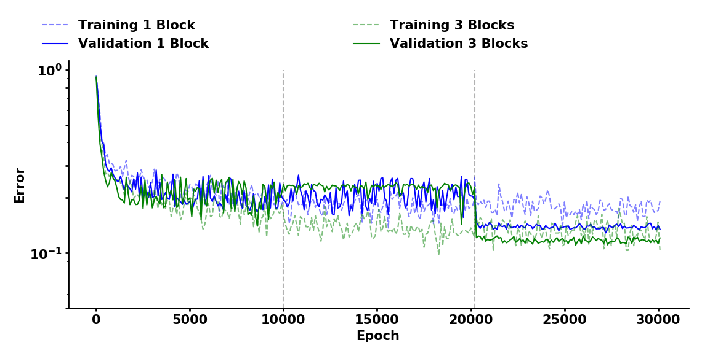

# QuantizedLSTM

This repository contains the models and training scripts used in the papers: "LSTMs for Keyword Spotting with ReRAM-based Compute-In-Memory Architectures" (ISCAS 2021).

## Requirements
- python 3.7
- python packages: argparse, uuid, time, itertools
- NumPy
- PyTorch and torchaudio
- Matplotlib

## Quantized LSTM with Google Speech Commands

<p align="center">

</p>

```
python KWS_LSTM.py
```

| Argument               | Parameter Name |  Description                                             | 
|:-----------------------|:----------------|:-----------------------------------------|
| -h, --help  |     |     show help message and exit |
| --random-seed | RANDOM_SEED |Random Seed (default: 80085) |
| --method | METHOD |      Method: 0 - blocks, 1 - orthogonality, 2 - mix (default: 1) |
| --dataset-path-train | DATASET_PATH_TRAIN | Path to Dataset (default: data.nosync/speech_commands_v0.02) |
| --dataset-path-test | DATASET_PATH_TEST | Path to Dataset (default: data.nosync/speech_commands_test_set_v0.02) |
| --word-list| WORD\_LIST [WORD\_LIST ...] | Keywords to be learned (default: ['yes', 'no', 'up', 'down', 'left', 'right', 'on', 'off', 'stop', 'go', 'unknown', 'silence']) |
| --batch-size | BATCH_SIZE | Batch Size (default: 100) |
| --training-steps | TRAINING_STEPS | Training Steps (default: 10000,10000,200) |
| --learning-rate | LEARNING_RATE| Learning Rate (default: 0.002,0.0005,0.00008) |
| --finetuning-epochs | FINETUNING_EPOCHS | Number of epochs for finetuning (default: 10000) |
| --dataloader-num-workers | DATALOADER\_NUM_WORKERS | Number Workers Dataloader (default: 8) |
| --validation-percentage | VALIDATION_PERCENTAGE | Validation Set Percentage (default: 10) |
| --testing-percentage | TESTING_PERCENTAGE | Testing Set Percentage (default: 10) |
| --sample-rate | SAMPLE_RATE | Audio Sample Rate (default: 16000) |
| --canonical-testing | CANONICAL_TESTING | Whether to use the canoncial test data (0 non canoncial, 1 canoncial. (default: 0) |
| --background-volume | BACKGROUND_VOLUME | How loud the background noise should be, between 0 and 1. (default: 0.1) |
| --background-frequency | BACKGROUND_FREQUENCY | How many of the training samples have background noise mixed in. (default: 0.8) |
| --silence-percentage | SILENCE_PERCENTAGE | How much of the training data should be silence. (default: 0.1) |
| --unknown-percentage | UNKNOWN_PERCENTAGE | How much of the training data should be unknown words. (default: 0.1) |
| --time-shift-ms | TIME\_SHIFT_MS | Range to randomly shift the training audio by in time. (default: 100.0) |
| --win-length | WIN_LENGTH | Window size in ms (default: 641) |
| --hop-length | HOP_LENGTH|  Length of hop between STFT windows (default: 320) |
| --hidden | HIDDEN  |     Number of hidden LSTM units (default: 108) |
| --n-mfcc | N_MFCC  |     Number of mfc coefficients to retain (default: 40) |
| --noise-injectionT  | NOISE_INJECTIONT | Percentage of noise injected to weights (default: 0.0) |
| --noise-injectionI | NOISE_INJECTIONI | Percentage of noise injected to weights (default: 0.1) |
| --quant-actMVM | QUANT_ACTMVM | Bits available for MVM activations/state (default: 6) |
| --quant-actNM | QUANT_ACTNM | Bits available for non-MVM activations/state (default: 8) |
| --quant-inp | QUANT_INP | Bits available for inputs (default: 4) |
| --quant-w | QUANT_W  |   Bits available for weights (default: None) |
| --l2 | L2        |       Strength of L2 norm (default: 0.01) |
| --n-msb | N_MSB    |     Number of blocks available (default: 4) |
| --cs  | CS       |        Strength cosine similarity penalization (default: 0.1) |
| --max-w | MAX_W  |       Maximumg weight (default: 0.2) |
| --drop-p  |DROP_P   |    Dropconnect probability (default: 0.125) |
| --pact-a |PACT_A   |    Whether scaling parameter is trainable (1:on,0:off) (default: 1) |
| --rows-bias |ROWS_BIAS | How many rows for the bias (default: 6) |
| --gain-blocks |GAIN_BLOCKS | Fox mixed method, how many parallel blocks (default: 2) |
